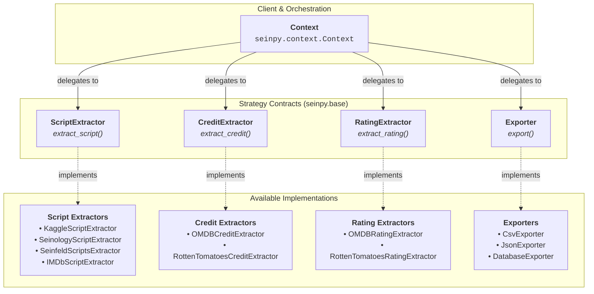

# Reference

This page provides background information, structural details, and architectural patterns of the **seinpy** package.

---

## About & Background

`seinpy` was built to address the lack of structured, easily accessible datasets containing Seinfeld episode scripts and their associated metadata. While script transcript datasets exist, they are often inconsistent in formatting, missing key details, or lack metadata (such as user ratings and cast/crew credits).

`seinpy` acts as a data pipeline that:

1. Downloads and parses raw scripts from multiple web sources.
2. Cross-references episodes against metadata to resolve inconsistencies in season and episode numbering.
3. Automatically fetches rich metadata (cast credits, rating distributions).
4. Exports the compiled data into CSV, JSON, or SQL Databases.

---

## Architecture

The package is designed around the **Strategy Pattern**. This makes it easy to switch out the extraction source for scripts, ratings, or credits without changing the core execution engine.



### Components

- **Context**: The orchestrator that receives concrete Strategy instances via its constructor or helper function `read_episodes`.
- **Script Extractors**: Strategies responsible for pulling and parsing episode scripts.
- **Credit Extractors**: Strategies responsible for pulling cast/crew metadata.
- **Rating Extractors**: Strategies responsible for pulling ratings (e.g., from OMDb or Rotten Tomatoes).
- **Exporters**: Strategies responsible for converting list of structured Pydantic/SQLModel models into target files.

---

## Usage Options & Configuration

When calling `read_episodes()`, you configure your source strategies using a source dictionary.

```python
source = {
    "script": "kaggle",  # Option for script source
    "credit": "omdb",       # Option for credits metadata
    "rating": "omdb",       # Option for ratings metadata
}
```

### Script Extraction Sources
- **`seinology`**: Extracts transcripts from Seinology.
- **`seinfeldscripts`**: Extracts transcripts from seinfeldscripts.com.
- **`kaggle`**: Extracts from Kaggle's Seinfeld script dataset.
- **`imdb`** / **`imsdb`**: Extracts scripts from IMSDb.

!!! warning

    Only `kaggle` is currently supported for script extraction

### Credit Extraction Sources
- **`omdb`**: Uses the Open Movie Database (OMDb) API. Requires `OMDB_API_KEY`.
- **`rottentomatoes`**: Scrapes Rotten Tomatoes for ratings/credits.

!!! warning

    Only `omdb` is currently supported for credit extraction

### Rating Extraction Sources
- **`omdb`**: Uses the Open Movie Database (OMDb) API. Requires `OMDB_API_KEY`.
- **`rottentomatoes`**: Scrapes Rotten Tomatoes for ratings/credits.

!!! warning

    Only `omdb` is currently supported for rating extraction

### Exporter Output Types
- **`csv`**: Writes tabular episode and line data.
- **`json`**: Writes a nested JSON schema representation.
- **`database`**: Populates a relational database (SQLite/PostgreSQL) using SQLModel.
